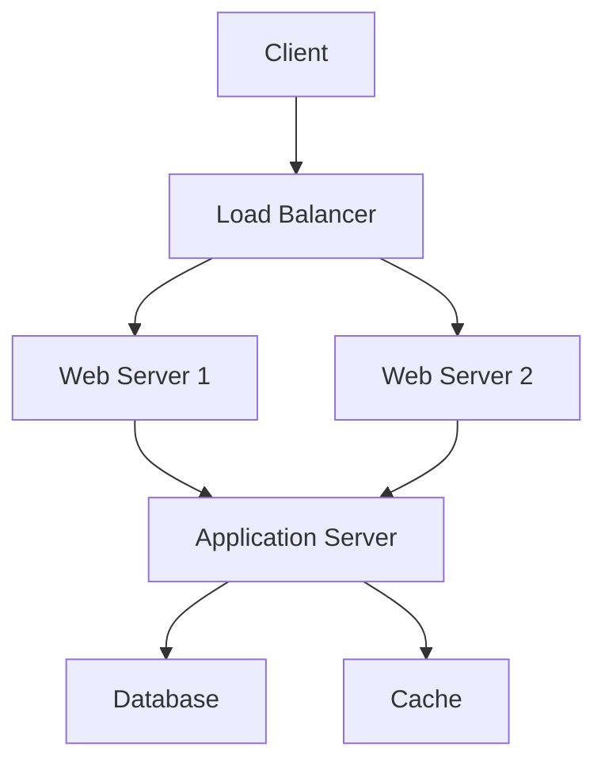

# Architecture Diagram Template

## Document Control
| **Version** | **Date** | **Author** | **Changes** |
|-------------|----------|------------|-------------|
| 1.0         |          |            | Initial Draft |

## 1. Introduction
### 1.1 Purpose
This document provides templates and guidelines for creating architecture diagrams that visually represent the system design.

### 1.2 Diagram Types
This template covers various types of architecture diagrams commonly used in system design:
- System Context Diagram
- Container Diagram
- Component Diagram
- Deployment Diagram
- Data Flow Diagram
- Sequence Diagram

### 1.3 Notation Standards
- Use C4 Model notation where applicable
- Use UML 2.0 standard for UML diagrams
- Maintain consistency in symbols and colors across diagrams

## 2. System Context Diagram
### 2.1 Purpose
Shows the system in its environment, including users and external systems it interacts with.

### 2.2 Template Structure
```
┌─────────────────────────────────────────────────────┐
│                  System Context                      │
│                                                      │
│  ┌──────────┐                        ┌──────────┐  │
│  │  User/   │───────────────────────>│  System  │  │
│  │  Actor   │<───────────────────────│          │  │
│  └──────────┘                        └──────────┘  │
│                                            │         │
│                                            v         │
│                                      ┌──────────┐  │
│                                      │ External │  │
│                                      │  System  │  │
│                                      └──────────┘  │
└─────────────────────────────────────────────────────┘
```

### 2.3 Elements to Include
- **System Boundary:** The system being designed
- **Users/Actors:** People who use the system
- **External Systems:** Other systems that interact with your system
- **Relationships:** Arrows showing interactions and data flow

### 2.4 Example
```
┌────────────────────────────────────────────────────────┐
│              E-Commerce System Context                  │
│                                                         │
│  ┌──────────┐                          ┌──────────┐   │
│  │ Customer │─── Browse/Order ────────>│   Web    │   │
│  │          │<──── Confirmation ───────│   App    │   │
│  └──────────┘                          └──────────┘   │
│                                             │           │
│                                             │           │
│                                             v           │
│  ┌──────────┐                          ┌──────────┐   │
│  │ Payment  │<───── Process Payment ───│ Payment  │   │
│  │ Gateway  │────── Response ─────────>│ Service  │   │
│  └──────────┘                          └──────────┘   │
│                                             │           │
│                                             v           │
│  ┌──────────┐                          ┌──────────┐   │
│  │ Email    │<───── Send Notification ─│   Email  │   │
│  │ Service  │                          │ Service  │   │
│  └──────────┘                          └──────────┘   │
└────────────────────────────────────────────────────────┘
```

## 3. Container Diagram
### 3.1 Purpose
Shows the high-level technology choices and how containers (applications, data stores) communicate.

### 3.2 Template Structure
```
┌─────────────────────────────────────────────────────┐
│                Container Diagram                     │
│                                                      │
│  ┌──────────────────────────────────────┐          │
│  │        Web Application               │          │
│  │  [Container: Technology]             │          │
│  └──────────────────────────────────────┘          │
│                    │                                 │
│                    v                                 │
│  ┌──────────────────────────────────────┐          │
│  │        API Application               │          │
│  │  [Container: Technology]             │          │
│  └──────────────────────────────────────┘          │
│                    │                                 │
│                    v                                 │
│  ┌──────────────────────────────────────┐          │
│  │           Database                   │          │
│  │  [Container: Database Type]          │          │
│  └──────────────────────────────────────┘          │
└─────────────────────────────────────────────────────┘
```

### 3.3 Elements to Include
- **Web Application:** Frontend container
- **API/Backend:** Business logic container
- **Database:** Data storage container
- **Cache:** Caching layer (if applicable)
- **Message Queue:** Async communication (if applicable)

## 4. Component Diagram
### 4.1 Purpose
Shows the internal structure of a container, breaking it down into components.

### 4.2 Template Structure
```
┌─────────────────────────────────────────────────────┐
│             Component Diagram                        │
│          [Container: API Application]                │
│                                                      │
│  ┌──────────────┐    ┌──────────────┐              │
│  │ Controller   │───>│   Service    │              │
│  │  Component   │    │  Component   │              │
│  └──────────────┘    └──────────────┘              │
│                            │                         │
│                            v                         │
│  ┌──────────────┐    ┌──────────────┐              │
│  │    Data      │    │ Integration  │              │
│  │   Access     │    │  Component   │              │
│  └──────────────┘    └──────────────┘              │
└─────────────────────────────────────────────────────┘
```

## 5. Deployment Diagram
### 5.1 Purpose
Shows how containers are deployed to infrastructure.

### 5.2 Template Structure
```
┌─────────────────────────────────────────────────────┐
│              Deployment Diagram                      │
│                                                      │
│  ┌─────────────────────────────────────────┐       │
│  │         Cloud Provider / Data Center     │       │
│  │                                          │       │
│  │  ┌────────────────────────────────┐    │       │
│  │  │     Region / Availability Zone  │    │       │
│  │  │                                 │    │       │
│  │  │  ┌──────────────────────────┐  │    │       │
│  │  │  │    Load Balancer         │  │    │       │
│  │  │  └──────────────────────────┘  │    │       │
│  │  │              │                  │    │       │
│  │  │  ┌───────────┴──────────┐     │    │       │
│  │  │  │                      │     │    │       │
│  │  │  v                      v     │    │       │
│  │  │  ┌──────────┐    ┌──────────┐│    │       │
│  │  │  │  Web     │    │   Web    ││    │       │
│  │  │  │ Server 1 │    │ Server 2 ││    │       │
│  │  │  └──────────┘    └──────────┘│    │       │
│  │  │              │                │    │       │
│  │  │              v                │    │       │
│  │  │  ┌──────────────────────────┐│    │       │
│  │  │  │    Application Servers   ││    │       │
│  │  │  └──────────────────────────┘│    │       │
│  │  │              │                │    │       │
│  │  │              v                │    │       │
│  │  │  ┌──────────────────────────┐│    │       │
│  │  │  │      Database Cluster    ││    │       │
│  │  │  │   Primary + Replicas     ││    │       │
│  │  │  └──────────────────────────┘│    │       │
│  │  └─────────────────────────────────┘  │       │
│  └─────────────────────────────────────────┘       │
└─────────────────────────────────────────────────────┘
```

### 5.3 Elements to Include
- **Infrastructure:** Cloud provider, data center
- **Network Zones:** Public, private subnets
- **Load Balancers:** Distribution of traffic
- **Application Instances:** Deployed containers
- **Databases:** Database servers and replication
- **Storage:** File storage, object storage

## 6. Data Flow Diagram
### 6.1 Purpose
Shows how data flows through the system.

### 6.2 Template Structure
```
┌─────────────────────────────────────────────────────┐
│               Data Flow Diagram                      │
│                                                      │
│   [External Entity]                                  │
│         │                                            │
│         │ (1) Request Data                           │
│         v                                            │
│   ┌──────────┐                                      │
│   │ Process  │                                      │
│   │    1     │                                      │
│   └──────────┘                                      │
│         │                                            │
│         │ (2) Query                                  │
│         v                                            │
│   [Data Store]                                       │
│         │                                            │
│         │ (3) Result                                 │
│         v                                            │
│   ┌──────────┐                                      │
│   │ Process  │                                      │
│   │    2     │                                      │
│   └──────────┘                                      │
│         │                                            │
│         │ (4) Response                               │
│         v                                            │
│   [External Entity]                                  │
└─────────────────────────────────────────────────────┘
```

### 6.3 Symbols
- **External Entity:** Rectangle - represents users or external systems
- **Process:** Rounded rectangle - processing or transformation
- **Data Store:** Open rectangle - database or file storage
- **Data Flow:** Arrow - direction of data movement

## 7. Sequence Diagram
### 7.1 Purpose
Shows the sequence of interactions between components over time.

### 7.2 Template Structure
```
Client          Web Server       API Server       Database
  │                 │                │                │
  │  HTTP Request   │                │                │
  │────────────────>│                │                │
  │                 │                │                │
  │                 │  API Call      │                │
  │                 │───────────────>│                │
  │                 │                │                │
  │                 │                │  Query         │
  │                 │                │───────────────>│
  │                 │                │                │
  │                 │                │  Result        │
  │                 │                │<───────────────│
  │                 │                │                │
  │                 │  Response      │                │
  │                 │<───────────────│                │
  │                 │                │                │
  │  HTTP Response  │                │                │
  │<────────────────│                │                │
  │                 │                │                │
```

### 7.3 Elements to Include
- **Actors/Systems:** Vertical lines representing participants
- **Messages:** Horizontal arrows showing interactions
- **Activation:** Boxes showing when an object is active
- **Return Messages:** Dashed arrows for responses

## 8. Network Architecture Diagram
### 8.1 Purpose
Shows the network topology and security zones.

### 8.2 Template Structure
```
┌─────────────────────────────────────────────────────┐
│            Network Architecture                      │
│                                                      │
│  Internet                                            │
│     │                                                │
│     v                                                │
│  ┌─────────────────────────────────────┐           │
│  │         Firewall / WAF              │           │
│  └─────────────────────────────────────┘           │
│     │                                                │
│     v                                                │
│  ┌─────────────────────────────────────┐           │
│  │      DMZ (Public Subnet)            │           │
│  │   ┌──────────┐   ┌──────────┐      │           │
│  │   │   Web    │   │   API    │      │           │
│  │   │  Tier    │   │ Gateway  │      │           │
│  │   └──────────┘   └──────────┘      │           │
│  └─────────────────────────────────────┘           │
│     │                                                │
│     v                                                │
│  ┌─────────────────────────────────────┐           │
│  │   Application Tier (Private Subnet) │           │
│  │   ┌──────────┐   ┌──────────┐      │           │
│  │   │   App    │   │   App    │      │           │
│  │   │ Server 1 │   │ Server 2 │      │           │
│  │   └──────────┘   └──────────┘      │           │
│  └─────────────────────────────────────┘           │
│     │                                                │
│     v                                                │
│  ┌─────────────────────────────────────┐           │
│  │   Data Tier (Private Subnet)        │           │
│  │   ┌──────────┐   ┌──────────┐      │           │
│  │   │   DB     │   │  Cache   │      │           │
│  │   │ Primary  │   │  Layer   │      │           │
│  │   └──────────┘   └──────────┘      │           │
│  └─────────────────────────────────────┘           │
└─────────────────────────────────────────────────────┘
```

## 9. Microservices Architecture Diagram
### 9.1 Purpose
Shows microservices and their interactions.

### 9.2 Template Structure
```
┌─────────────────────────────────────────────────────┐
│         Microservices Architecture                   │
│                                                      │
│  ┌──────────────────────────────────────┐          │
│  │         API Gateway                  │          │
│  └──────────────────────────────────────┘          │
│       │         │         │         │               │
│       v         v         v         v               │
│  ┌────────┐ ┌────────┐ ┌────────┐ ┌────────┐     │
│  │Service │ │Service │ │Service │ │Service │     │
│  │   A    │ │   B    │ │   C    │ │   D    │     │
│  └────────┘ └────────┘ └────────┘ └────────┘     │
│       │         │         │         │               │
│       v         v         v         v               │
│  ┌────────┐ ┌────────┐ ┌────────┐ ┌────────┐     │
│  │  DB A  │ │  DB B  │ │  DB C  │ │  DB D  │     │
│  └────────┘ └────────┘ └────────┘ └────────┘     │
│                                                      │
│  ┌──────────────────────────────────────┐          │
│  │      Message Queue / Event Bus       │          │
│  └──────────────────────────────────────┘          │
└─────────────────────────────────────────────────────┘
```

## 10. Diagram Creation Tools
### 10.1 Recommended Tools
- **Draw.io / diagrams.net:** Free, web-based
- **Lucidchart:** Commercial, collaborative
- **PlantUML:** Text-based, version control friendly
- **Mermaid.js:** Markdown-integrated diagrams
- **Microsoft Visio:** Enterprise standard
- **ArchiMate:** Enterprise architecture tool
- **C4-PlantUML:** C4 model templates for PlantUML

### 10.2 PlantUML Examples
**Note:** The code block language is set to `plantuml` for syntax highlighting. Some markdown processors may not support this language identifier.

```plantuml
@startuml
!include https://raw.githubusercontent.com/plantuml-stdlib/C4-PlantUML/master/C4_Container.puml

Person(user, "User", "End user of the system")
System_Boundary(system, "System") {
    Container(web, "Web Application", "React", "User interface")
    Container(api, "API", "Node.js", "Business logic")
    ContainerDb(db, "Database", "PostgreSQL", "Stores data")
}
System_Ext(email, "Email Service", "Sends emails")

Rel(user, web, "Uses", "HTTPS")
Rel(web, api, "Calls", "JSON/HTTPS")
Rel(api, db, "Reads/Writes", "SQL")
Rel(api, email, "Sends email via", "SMTP")

@enduml
```

### 10.3 Mermaid Examples


## 11. Best Practices
### 11.1 General Guidelines
1. **Keep It Simple:** Don't overcomplicate diagrams
2. **Consistent Notation:** Use standard symbols and colors
3. **Clear Labels:** Label all components and connections
4. **Appropriate Detail:** Match detail level to audience
5. **Version Control:** Keep diagrams in source control
6. **Update Regularly:** Keep diagrams in sync with implementation

### 11.2 Color Coding
- **Blue:** User-facing components
- **Green:** Internal services
- **Orange:** External systems
- **Red:** Critical/security components
- **Gray:** Infrastructure

### 11.3 Documentation
- Always include a legend
- Add notes for complex interactions
- Document assumptions and constraints
- Include version and date information

## 12. Review Checklist
- [ ] All components are labeled clearly
- [ ] Connections show direction and protocol
- [ ] Legend is included for symbols and colors
- [ ] Diagram has title and version
- [ ] Appropriate level of detail for audience
- [ ] Consistent with other documentation
- [ ] All external dependencies shown
- [ ] Security boundaries indicated
- [ ] Data flow is clear
- [ ] Scalability approach is evident

## Appendices
### Appendix A: Symbol Reference
<!-- Standard symbols used in diagrams -->

### Appendix B: Example Diagrams
<!-- Full examples of complete architecture diagrams -->

### Appendix C: Template Files
<!-- Links to editable template files in various tools -->
