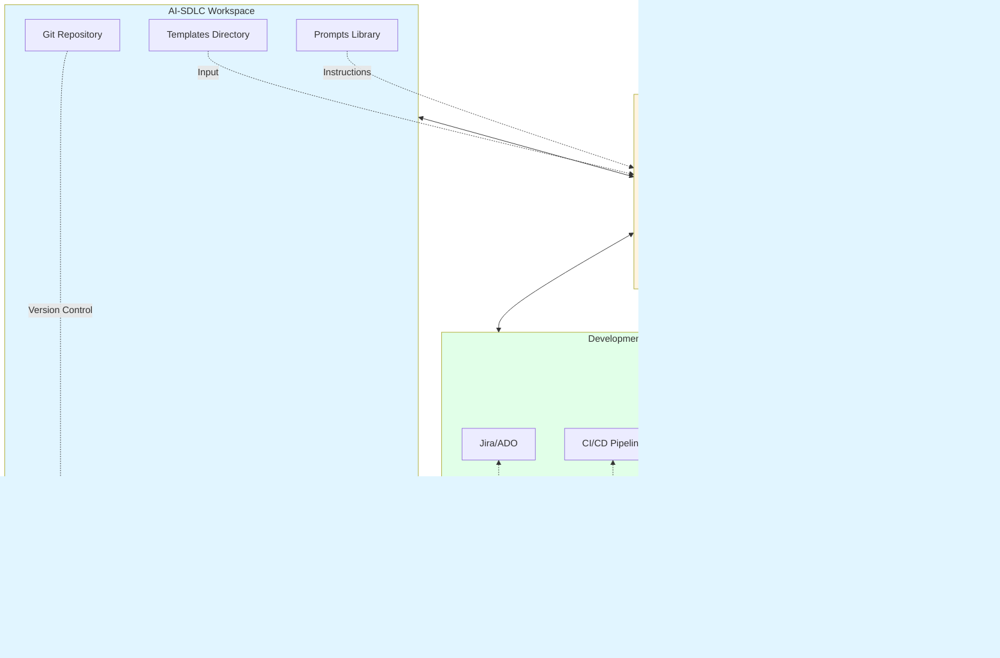

# AI-SDLC Architecture Flow

## Document Control
| Version | Date | Author | Reviewer | Changes |
|---------|------|--------|----------|---------|
| 1.0     | 2025-11-19 | AI Agent | - | Initial architecture flow diagram |

## Purpose

This document provides a comprehensive Mermaid-based visualization of the AI-SDLC workflow, showing the flow from inception through operations, including agent personas, artifacts, and dependencies.

## Architecture Overview

The AI-SDLC framework follows a phased approach with 7 distinct phases, each with specific personas, deliverables, and quality gates. The diagram below illustrates the complete flow.

## High-Level SDLC Flow Diagram

## Traceability & Governance Flow

## Detailed Phase Workflow

## Agent Collaboration Model

## Document Traceability Chain

## Technology Stack & Integration Points

## Key Features

### Phase Gates
Each phase has explicit entry and exit criteria enforced through phase gates:
- **Entry Criteria**: Prerequisites that must be met before starting the phase
- **Exit Criteria**: Deliverables and quality metrics required to proceed
- **Quality Gates**: Automated and manual checks
- **Go/No-Go Decision**: Formal approval from governance board

### Traceability
The Requirements Traceability Matrix (RTM) serves as the single source of truth:
- Links requirements to design, development, testing, and operations
- Bidirectional sync with Jira/Azure DevOps
- Automated coverage tracking
- Change impact analysis

### Governance
Continuous governance through:
- Change Log: Records all decisions, risks, and baselines
- Approval Tables: Embedded in each template for sign-offs
- Version Control: Document history and audit trail
- Compliance Alignment: Security, privacy, and regulatory requirements

### Automation
AI agents automate documentation creation:
- Template-driven approach ensures consistency
- Persona-specific prompts guide each agent
- Parallel execution where dependencies allow
- Quality checks before phase transitions

## Usage

1. **Start with Inception**: Ensure business case and stakeholder alignment
2. **Follow Phase Sequence**: Respect dependencies and phase gates
3. **Update RTM Continuously**: Maintain traceability throughout
4. **Record in Change Log**: Document all decisions and changes
5. **Obtain Approvals**: Use embedded approval tables
6. **Iterate as Needed**: Feedback loop from operations to requirements

## References

- [README.md](../README.md) - Repository overview and quick start
- [AGENTS.md](../AGENTS.md) - Agent operating handbook
- [Phase Gates Template](../ templates/phase-gates.md) - Detailed gate criteria
- [RTM Template](../ templates/RTM.md) - Traceability matrix structure
- [Prompts Catalog](../prompts/SDLC_AI_Agent.md) - All agent prompts
